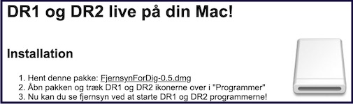

# VLC shortcuts for macOS

This project provided user friendly shortcuts to watch live TV from the [Danish Broadcasting Corporation](https://en.wikipedia.org/wiki/DR_(broadcaster)) in 2009-2011.

[Screenshot from Internet
Archive](https://web.archive.org/web/20100715044740/http://www.thomaslkjeldsen.dk/fjernsynfordig/):

> 

## Related

Monitoring H264 RTSP streams: https://github.com/tlk/dr-h264-stream-status